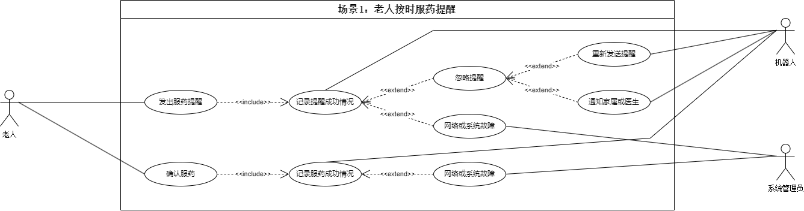
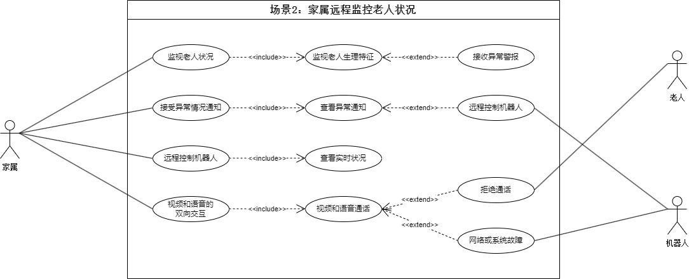
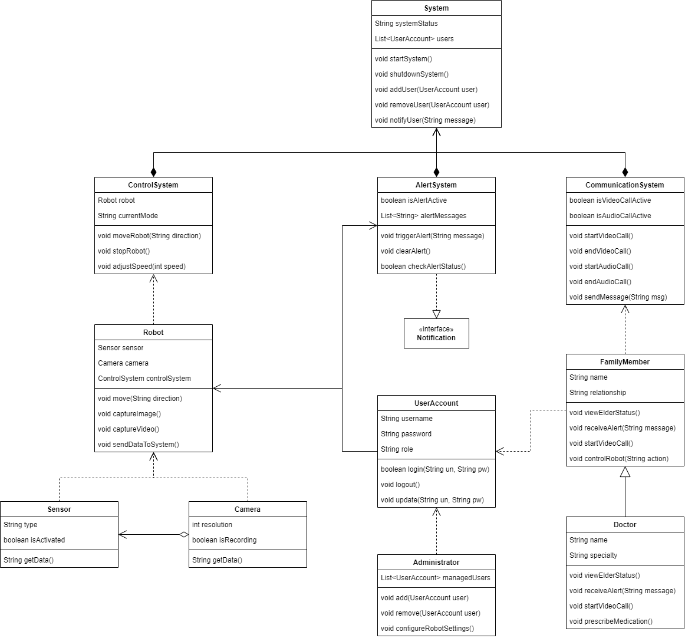

# 空巢老人看护软件系统的需求分析与设计

## 1 系统功能分析

### 1.1 场景1：老人按时服药提醒

#### 1.1.1 参与者

* 主参与者：老人
* 次要参与者：机器人
* 其他参与者：系统管理员

#### 1.1.2 目标

系统能够在设定的时间提醒老人按时服药，确保老人不会忘记服药，从而提高老人的健康管理。

#### 1.1.3 前置条件

* 老人已经在系统中注册并且系统中有老人的健康管理信息（包括服药时间和药物信息）。
* 机器人已连接并能正常工作，且能够进行语音或屏幕提醒。
* 老人的服药时间已设置在系统中。

#### 1.1.4 后置条件

* 老人收到了服药提醒。
* 机器人通过语音或屏幕提醒老人按时服药。

#### 1.1.5 主要成功场景

* 系统根据预设的时间触发提醒。
* 机器人通过语音或屏幕向老人发出服药提醒。
* 老人确认或听取提醒，并按照系统提示服药。
* 服药提醒完成，系统记录提醒的成功情况。

#### 1.1.6 扩展流程

* 扩展1：提醒失败。
  * 机器人未能正常发出提醒。
  * 系统检测到失败并重新触发提醒。
  * 如果依然失败，系统会发送通知给管理员进行检查。
* 扩展2：老人忽略提醒。
  * 老人在收到提醒后未做任何反应。
  * 系统记录老人未回应的情况，并在一段时间后重新提醒老人。
  * 如果多次未回应，系统将通过消息通知家属或医生，提醒他们检查老人情况。

#### 1.1.7 优先级

高优先级：服药提醒是一个关键功能，直接关系到老人的健康管理，因此需要确保高可靠性和及时性。

#### 1.1.8 可用性

该功能应当全天候可用，特别是在需要按时服药的关键时段，如早晨或晚上，系统必须保证提醒的及时性和准确性。

#### 1.1.9 使用频率

中频率：每天按预设的时间提醒老人服药，使用频率与服药时间相关。通常会是每日固定时间，可能会有多个提醒。

#### 1.1.10 使用方式

* 老人：通过语音或屏幕接收提醒。
* 机器人：通过语音或显示屏的提醒功能传达服药信息，确保老人能够看到或听到提醒。
* 系统管理员：负责在后台设置和管理服药提醒的时间、频率等参数，确保提醒时间和内容的准确性。

#### 1.1.11 未解决的问题

* 问题1：如果老人存在听力障碍或无法理解提醒内容，系统应该支持多种提醒方式（如图形、文字、振动等）以适应不同需求。
* 问题2：当系统或机器人出现故障时，如何确保提醒不遗漏，是否有备用提醒方式或复原机制？

### 1.2 场景2：家属远程监控老人状况

#### 1.2.1 参与者

* 主参与者：家属
* 次要参与者：老人
* 其他参与者：机器人

#### 1.2.2 目标

家属通过智能手机或电脑等设备，远程监控老人在家的实时状况，包括视频、图像、语音等信息。家属能够随时查看老人是否安全，并在必要时与老人进行语音或视频交互。

#### 1.2.3 前置条件

* 家属已在系统中注册并且具有相应权限。
* 老人和家属的设备（如智能手机、平板、电脑等）已连接到系统。
* 机器人已启用并且能够提供实时视频、图像和语音数据。
* 家属设备上已安装并正常运行监控APP。
* 机器人处于正常工作状态，可以提供老人状况的实时反馈。

#### 1.2.4 后置条件

* 家属能够通过其设备成功查看到老人的实时状况。
* 家属能够与老人进行语音或视频通话。
* 家属能够接收到机器人的报警或异常状态提示（如老人摔倒等）。
* 若家属发起了远程控制，机器人会根据家属指令调整位置。

#### 1.2.5 主要成功场景

* 家属通过智能手机启动应用程序，并登录到系统。
* 家属选择远程监控老人并查看实时视频、图像、语音信息。
* 系统将机器人采集到的实时数据（如视频、语音、图像）传输到家属的设备上。
* 家属发现异常（如老人摔倒或出现突发健康问题），系统自动发出警报。
* 家属通过语音或视频与老人进行互动。
* 家属可以通过APP控制机器人，调整机器人跟随老人的位置，获取不同角度的视频图像。
* 监控会话结束后，家属退出系统。

#### 1.2.6 扩展流程

* 扩展1：监控失败
  * 系统检测到网络连接丢失或设备故障。
  * 系统尝试重新连接。
  * 如果持续失败，系统通知家属设备无法连接，并提供排查建议。
* 扩展2：家属发起远程控制
  * 家属在APP中选择“控制机器人”。
  * 机器人根据家属指令调整运动，改变观察角度或位置。
* 扩展3：老人拒绝视频通话
  * 老人收到视频通话请求后拒绝接听。
  * 系统记录并通知家属老人拒绝接听视频通话。

#### 1.2.7 优先级

中高优先级：家属远程监控是空巢老人看护系统中的重要功能，有助于家属及时了解老人状况，特别是对有健康风险的老人至关重要。

#### 1.2.8 可用性

该功能需要24/7全天候可用，尤其是在老人健康状况不稳定时，家属需要随时查看老人状况。

#### 1.2.9 使用频率

中频率：家属可能根据实际需求，在每天的不同时间段使用该功能，频率较为灵活，取决于家属的关心程度和老人的健康状况。

#### 1.2.10 使用方式

* 家属：通过手机或电脑应用程序登录系统，查看老人状况，接收异常警报，进行语音或视频交互，远程控制机器人。
* 机器人：持续监控老人状态并提供实时数据，如视频、图像和语音等；根据家属的指令调整位置和观察角度。

#### 1.2.11 未解决的问题

* 问题1：在网络不稳定的情况下，视频和语音的质量可能会受到影响，如何保证家属能够清晰地监控到老人的状况并进行及时的应对？
* 问题2：老人的隐私问题可能需要特别关注，如何保证监控数据仅限授权家属和医生访问？系统如何防止未授权的访问？

## 2 系统类分析及设计

## 3 软件非功能需求

### 3.1 性能需求

* 响应时间：系统用户界面的操作响应时间必须不超过 0.5 秒。
* 实时性：当系统检测到老人的突发异常情况时，需在 3 秒内向家属和医生发送警报通知。
* 视频流畅度：视频通话和实时视频监控的帧率不低于 30fps，以保证流畅的图像展示。
* 数据处理能力：系统需要支持同时最多 100个用户同时登录并执行监控、报警、控制等操作。

### 3.2 可靠性需求

* 系统可用性：系统必须 7x24小时不间断运行，保证 每周七天、每天二十四小时的可用性。
* 故障恢复：系统发生故障后，必须在 5分钟内恢复正常运行，确保服务不间断。
* 冗余备份：关键系统组件（如数据库）必须实现数据备份和冗余，以防止数据丢失。
* 故障容错：系统应具备容错能力，能够在单点故障发生时不影响整体服务。

### 3.3 安全性需求

* 数据加密：用户数据、老人的个人健康信息和视频流必须进行 加密存储 和 加密传输，防止数据泄露。
* 身份认证与授权：系统必须实现基于角色的 身份认证和授权，不同用户（家属、医生、管理员等）根据角色拥有不同的访问权限。
* 日志记录：系统应记录所有重要操作的日志（如：用户登录、设备控制、警报触发等），并能进行查询和审计。
* 防攻击能力：系统必须防范常见的网络攻击（如：DDoS攻击、SQL注入、跨站脚本攻击等）。

### 3.4 可维护性需求

* 模块化设计：系统应采用模块化架构，能够方便地进行功能扩展和维护。
* 代码可读性：系统代码应具有清晰的注释和文档，以便开发人员能够快速理解和维护。
* 自动化测试：系统必须支持自动化单元测试和集成测试，保证软件在每次更新后都能进行快速验证。

### 3.5 可扩展性需求

* 用户扩展：系统应支持未来扩展以容纳更多的用户，至少支持 1000名用户同时在线并进行视频监控和控制。
* 设备扩展：系统应支持将来添加新的硬件设备（如新类型的传感器、摄像头等），不需要对现有系统进行大规模重构。
* 地域扩展：系统应支持多区域部署，能够在不同地理位置的用户间共享数据。

### 3.6 用户体验需求

* 用户界面友好：系统的用户界面必须简单易用，支持家属、医生和管理员快速理解操作流程。
* 多语言支持：系统应支持中文和英文两种语言，能够根据用户的语言设置动态切换界面语言。
* 移动端适配：系统应支持安卓和iOS平台的移动端应用，保证在不同平台上的一致性和流畅体验。

## 4 软件开发约束需求

### 4.1 操作系统和平台约束

* 移动端：手机端应用（APP）必须支持 Android 4.4及以上版本，iOS平台应用需要支持iOS 10.0及以上版本。
* 机器人控制：机器人控制软件必须运行在 Ubuntu 14.04及以上版本的操作系统上。
* 系统兼容性：软件需要兼容当前主流操作系统的浏览器（如：Chrome, Firefox, Safari 等），保证不同操作系统上的一致性体验。

### 4.2 技术选型约束

* 编程语言：移动端应用建议使用 Kotlin（Android）和 Swift（iOS）进行开发，系统端应用建议使用 Java 或 Python 进行开发。
* 框架和库：前端界面可以使用现代的前端框架如 React 或 Vue.js。后端系统可以使用 Spring Boot（Java）或 Django（Python）等框架。
* 数据库：推荐使用 MySQL 或 PostgreSQL 作为系统数据库，存储老人健康数据和用户信息。
* 通信协议：系统内部的数据通信需要使用 HTTPS协议进行加密传输，保证数据的安全性。

### 4.3 硬件兼容性约束

* 机器人硬件要求：机器人必须具备基本的感知能力，如红外传感器、高清摄像头、麦克风等。
* 摄像头和传感器的分辨率和带宽：摄像头要求至少支持 1080p 分辨率的视频流，传感器需要能够实时传输数据至机器人或服务器。

### 4.4 开发周期约束

* 开发周期：系统的初期开发必须在 6个月内完成，包括前期需求分析、设计、编码、测试等工作，确保系统在试运行阶段稳定。
* 版本发布：系统应按计划每 三个月发布一个主要版本更新，每 一个月发布一次小版本修复更新。

### 4.5 合规性约束

* 隐私保护合规：系统必须符合 GDPR（General Data Protection Regulation，欧盟通用数据保护条例）和中国 网络安全法 的要求，确保用户隐私和健康数据的保护。
* 医疗合规：如系统涉及医疗健康数据处理，应符合相关医疗软件法规和标准，例如 HIPAA（Health Insurance Portability and Accountability Act，健康保险流通与问责法案）等。

### 4.6 兼容性约束

* 跨平台兼容：系统的移动端应用（Android/iOS）和桌面端管理平台必须保证数据同步，功能一致，用户能够无缝切换平台。
* 数据库兼容性：数据库设计需要保证在数据库升级时，不会丢失数据，且能在多版本间兼容运行。