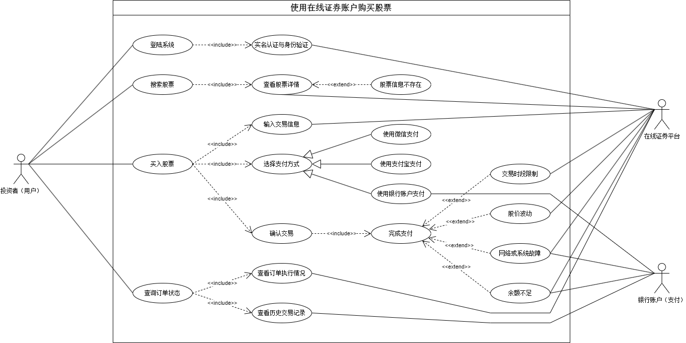

# 基于场景的需求分析：使用在线证券账户购买股票

## 1 用例需求分析

### 1.1 参与者

* **主要参与者**：投资者（用户）
  * 投资者是使用在线证券平台进行股票购买操作的用户。他们可以通过平台查询股票信息、提交交易指令以及管理账户信息。
* **辅助系统**：在线证券平台、银行账户（支付）
  * 在线证券平台：该平台提供股票信息查询、账户管理、交易处理和支付结算等服务，供用户在平台上进行股票交易。
  * 银行账户（支付）：用于用户的交易资金管理，包括用户账户余额查询和交易扣款的功能。

### 1.2 前置条件

* **注册与登录**：投资者已在系统中注册了账户，并成功登录至在线证券平台。
* **账户绑定**：投资者的证券账户已经绑定了支付的银行账户，以便资金在交易过程中的转入转出。
* **实名认证与身份验证**：为了确保交易的安全性和合法性，用户需完成实名认证及相关身份验证（如短信验证或双重身份认证）。

### 1.3 后置条件

* **交易成功**：股票购买成功后，系统会自动更新投资者的账户持仓和余额信息，显示新增的股票持仓情况，并减去相应的购买金额。
* **交易失败**：若购买失败（如余额不足、非交易时段等），则系统将显示相应错误或提示信息，用户的账户信息保持不变。

### 1.4 主要成功场景（主流程）

1. **登录系统**：投资者打开在线证券平台，输入用户名和密码，系统验证用户身份后，投资者成功进入个人账户。
2. **搜索股票**：投资者在平台的搜索框中输入目标股票的代码或名称，系统在后台查找对应的股票，并将结果展示给投资者。
3. **查看股票详情**：投资者选择股票后，系统显示该股票的详细信息，包括实时价格、历史数据、涨跌幅、买入/卖出价等信息，投资者可以据此进行交易决策。
4. **选择买入操作**：若投资者决定购买，点击“买入”按钮，系统跳转至股票购买页面。
5. **输入交易信息**：在购买页面，投资者输入所需购买的股票数量或投入金额，系统根据实时价格计算并显示预计总价。
6. **确认交易**：投资者点击“确认购买”，系统弹出确认信息（包括股票数量、总价、费用等），投资者确认无误后提交交易。
7. **完成支付**：系统从用户的绑定银行账户或证券账户中扣除相应金额，完成支付。
8. **购买成功**：系统确认交易完成，更新投资者的账户持仓和余额，投资者可在持仓信息中看到新增的股票。

### 1.5 扩展流程（备选路径）

#### 1.5.1 余额不足

* **描述**：当投资者账户余额不足以完成股票购买时，系统会提示用户充值或减少购买量。
* **处理**：用户可以选择增加账户余额或调整购买股票数量，重新发起购买。

#### 1.5.2 股票交易时段限制

* **描述**：如果用户在非交易时段尝试下单，系统将提示交易时间的限制。
* **处理**：投资者可以选择等待至交易时段内重新操作，或将订单挂单，等待交易时段执行。

#### 1.5.3 股价波动

* **描述**：投资者下单时可能会遇到股票价格波动，系统重新计算最新价格并提示用户。
* **处理**：投资者确认是否接受最新价格，若接受则继续交易，否则取消订单。

#### 1.5.4 网络或系统故障

* **描述**：若交易过程中遇到系统异常或网络中断，系统会显示失败通知。
* **处理**：投资者可以在稍后重新发起交易，或联系平台客服以寻求帮助。

### 1.6 业务规则

* **交易时段限制**：股票交易只能在市场开放时段内进行，闭市和节假日不允许交易。
* **价格限制**：系统设定市场波动的价格限制，当价格波动超过一定幅度时，暂停股票的买入操作。
* **账户信息更新**：每次交易成功后，系统自动更新投资者的持仓信息和账户余额，确保投资者资产的实时准确性。

### 1.7 UML 用例图

| 编号 | 用例名称 | 描述 | 关联用例 |
| :--- | :--- | :--- | :--- |
| 1 | 登录系统 | 投资者通过输入用户名和密码登录在线证券平台。 | <include> 实名认证与身份验证 |
| 2 | 实名认证与身份验证 | 投资者在进行交易前需完成实名认证和身份验证，以确保账户的安全性和合法性。 |  |
| 3 | 搜索股票 | 投资者可以通过输入股票代码或名称来搜索目标股票。 | <include> 查看股票详情 |
| 4 | 查看股票详情 | 投资者选择股票后，系统展示股票的详细信息，例如实时价格、历史数据等。 |  |
| 5 | 股票信息不存在 | 投资者输入的股票代码或名称不存在，系统会提示股票信息不存在。 | <extend> 查看股票详情 |
| 6 | 买入股票 | 投资者决定购买股票后，进入购买页面，输入购买数量，选择支付方式并确认交易。 | <include> 输入交易信息、选择支付方式、确认交易 |
| 7 | 输入交易信息 | 在购买页面输入股票数量或金额，系统显示预计总价。 |  |
| 8 | 选择支付方式 | 投资者可以选择微信支付、支付宝支付或银行账户支付来完成交易。 |  |
| 9 | 确认交易 | 投资者确认无误后提交交易，系统弹出确认信息，包括股票数量、总价、费用等。 | <include> 完成支付 |
| 10 | 完成支付 | 投资者确认交易信息并选择支付方式，支付成功后系统更新持仓信息和账户余额。 |  |
| 11 | 交易时段限制 | 用户尝试在非交易时段下单时，系统提示时间限制。 | <extend> 完成支付 |
| 12 | 股价波动 | 下单过程中可能遇到股价波动，系统重新计算最新价格并提示用户确认。 | <extend> 完成支付 |
| 13 | 网络或系统故障 | 交易过程中若出现系统故障或网络问题，系统显示失败通知。 | <extend> 完成支付 |
| 14 | 余额不足 | 当账户余额不足以完成购买时，系统提示充值或减少购买量。 | <extend> 完成支付 |
| 15 | 查询订单状态 | 投资者可以查询订单执行情况，查看当前订单的状态。 | <include> 查看订单执行情况、查看历史交易记录 |
| 16 | 查看订单执行情况 | 投资者可以查询订单的执行状态，了解订单是否已成交或待处理。 |  |
| 17 | 查看历史交易记录 | 投资者可以查看以往交易的详细记录，便于复盘或记录。 |  |

### 1.8 UML 活动图

## 2 软件需求分析

### 2.1 功能性需求

#### 2.1.1 账户管理

* 用户可以注册、登录、注销账户，并进行密码管理（重置密码、修改密码等）。
* 用户可以进行账户实名认证，绑定银行账户，确保交易的合法性和安全性。

#### 2.1.2 股票信息查询

* 用户可以通过股票代码或名称搜索股票，获取该股票的实时价格、涨跌情况、历史走势、买入/卖出价等详细信息。
* 系统支持查看市场行情，包括各大股指、热点板块和行业走势，帮助用户了解市场全貌。

#### 2.1.3 交易功能

* 买入股票：用户可以在交易时间内选择股票并输入数量或金额，系统会根据实时价格进行交易。
* 卖出股票：用户可以选择持有的股票进行卖出操作，输入数量后系统根据实时价格完成交易。
* 查看持仓：用户可以查看账户中已持有的股票及其市值、收益情况。
* 历史交易记录：用户可以查询历史交易记录，包括买入、卖出、分红、配股等明细。

#### 2.1.4 支付与结算

* 系统支持用户绑定银行账户，并在交易时从银行账户中扣款或收款。
* 系统提供资金明细查询，展示用户的交易流水、资金变动情况等信息。

#### 2.1.5 通知与提醒

* 系统会在重要事件发生时发送提醒，例如股价达到用户设置的提醒价位、资金变动、交易成功或失败等。
* 用户可以设置股票价格提醒、交易时段提醒等个性化通知。

#### 2.1.6 用户支持

* 系统提供常见问题解答和帮助中心，用户可以查询相关操作指南。
* 系统支持在线客服咨询，帮助用户解决使用中的问题。

### 2.2 非功能性需求

#### 2.2.1 性能需求

* 响应时间：用户操作（如查询股票、提交交易）的响应时间应小于2秒，以提供良好的用户体验。
* 系统吞吐量：在高峰时段应能支持上万用户同时查询和交易，保障系统的稳定性。
* 交易处理速度：交易提交后，系统需在短时间内确认交易状态（如成功或失败）。

#### 2.2.2 可靠性需求

* 系统应保证数据的准确性和一致性，特别是涉及到交易金额、股价、用户资金时。
* 系统需提供备份和恢复功能，防止因数据丢失造成的损失。

#### 2.2.3 安全性需求

* 用户数据保护：系统需采取加密措施，保护用户的个人信息、银行账户信息等敏感数据。
* 身份验证：系统需进行多重身份验证，包括登录密码、短信验证等，以防止账号被非法访问。
* 交易安全：交易过程中的数据传输需使用SSL等加密协议，确保数据不被篡改或窃取。

#### 2.2.4 可用性需求

* 系统需具备良好的稳定性和可用性，保证在工作时间和交易高峰期内系统正常运行。
* 提供用户友好的界面设计，确保操作流程清晰、易用，帮助用户快速完成交易。

#### 2.2.5 兼容性需求

* 系统需兼容主流的操作系统和浏览器，包括Windows、MacOS、Linux，以及Chrome、Firefox、Safari等浏览器，确保用户体验一致性。
* 支持PC端和移动端访问，为用户提供跨平台的操作便利性。

#### 2.2.6 扩展性需求

* 系统设计需具有良好的扩展性，以支持后续增加的新功能（如更多的投资品种或高级分析工具）。
* 允许系统负载均衡，以适应日益增长的用户量和数据量。

#### 2.2.7 维护性需求

* 系统应具备良好的代码结构和文档说明，以便于后续的维护和升级。
* 提供自动监控和预警机制，及时发现和处理系统故障。

## 3 系统模型设计

### 3.1 系统架构设计

采用三层架构：

* **表现层**：负责用户交互和信息展示（如登录、股票查询、交易界面）。
* **业务逻辑层**：处理核心交易逻辑（如账户管理、交易、风控）。
* **数据访问层**：负责数据存储和读取，通过缓存加速数据访问。

### 3.2 模块设计

#### 3.2.1 账户管理模块

**功能**：支持用户注册、登录、实名认证、账户绑定及密码管理。

**主要类和方法**：

* `UserService`：提供用户增删改查、登录验证等服务。
* `AuthenticationService`：负责认证和授权，包括多重身份验证和权限管理。
* `AccountBindingService`：绑定用户银行账户、管理支付接口。

#### 3.2.2 股票信息查询模块

**功能**：支持股票搜索、实时数据展示、行情分析等功能。

**主要类和方法**：

* `StockService`：获取股票基本信息及行情数据。
* `MarketDataService`：连接证券交易所API，提供实时数据更新。
* `SearchService`：支持根据股票代码、名称的模糊搜索。

#### 3.2.3 交易管理模块

**功能**：完成股票的买入、卖出操作，支持持仓和历史记录查询。

**主要类和方法**：

* `OrderService`：处理用户的买卖指令，包括提交订单、撤销订单等操作。
* `PortfolioService`：管理用户的股票持仓，计算收益和亏损。
* `TransactionHistoryService`：记录并查询交易历史。

#### 3.2.4 风控模块

**功能**：对交易进行风险控制，确保符合市场规则和用户风险偏好。

**主要类和方法**：

* `RiskEvaluationService`：根据用户的风险偏好和市场情况进行交易限制。
* `PriceMonitorService`：监控股票价格波动，防止异常交易。

#### 3.2.5 通知服务模块

**功能**：向用户发送交易提醒、价格警报等通知。

**主要类和方法**：

* `NotificationService`：根据交易和价格条件触发通知。
* `EmailService/SmsService`：实现邮件和短信提醒功能。

#### 3.2.6 支付结算模块

**功能**：负责交易的资金扣款、入账等功能。

**主要类和方法**：

* `PaymentService`：完成扣款和结算，包括第三方支付接口集成。
* `BalanceService`：管理用户的账户余额，提供资金查询和更新服务。

### 3.3 数据模型设计

主要表结构：

* **用户表**：存储用户基本信息。
  * 字段：用户ID、用户名、密码、手机号、电子邮件、实名认证状态、账户状态等。
* **账户表**：记录账户类型和余额。
  * 字段：账户ID、用户ID、账户类型（股票账户、资金账户）、绑定银行账户信息、账户余额等。
* **股票表**：保存股票信息和价格。
  * 字段：股票ID、股票代码、名称、市场类型、当前价格、涨跌幅、历史数据等。
* **交易表**：记录交易历史。
  * 字段：交易ID、用户ID、股票ID、买卖类型、交易数量、交易价格、交易状态、时间戳等。
* **通知表**：保存通知记录。
  * 字段：通知ID、用户ID、通知类型（价格提醒、交易通知）、内容、发送状态、时间戳等。

### 3.4 接口设计

主要API：

* **用户接口**：注册、登录、获取用户信息。
* **股票接口**：获取股票详情、搜索股票。
* **交易接口**：提交买卖订单、查询历史交易。
* **账户接口**：查询余额、绑定银行账户。
* **通知接口**：设置价格提醒、查看通知。